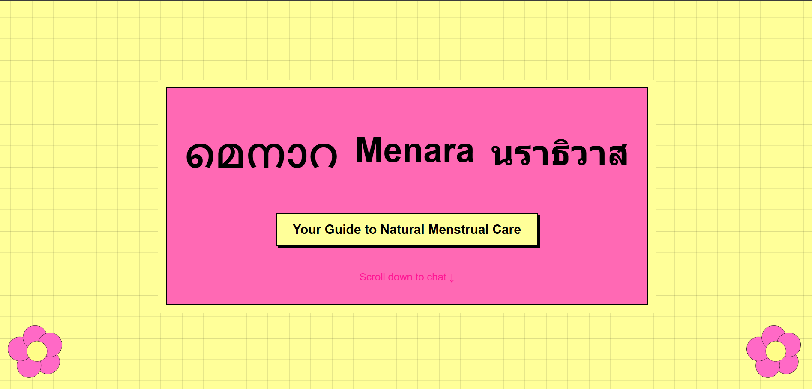
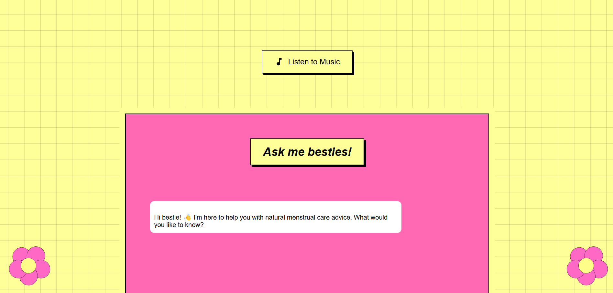
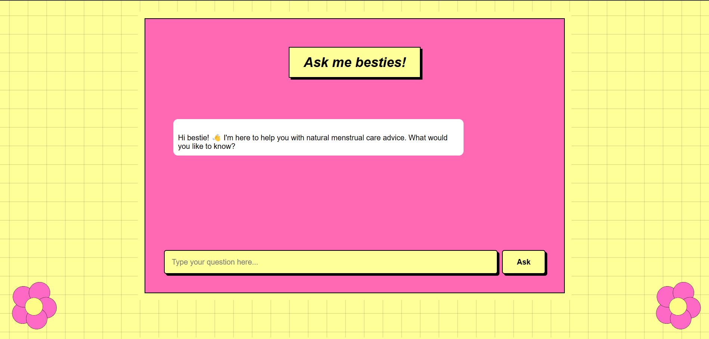
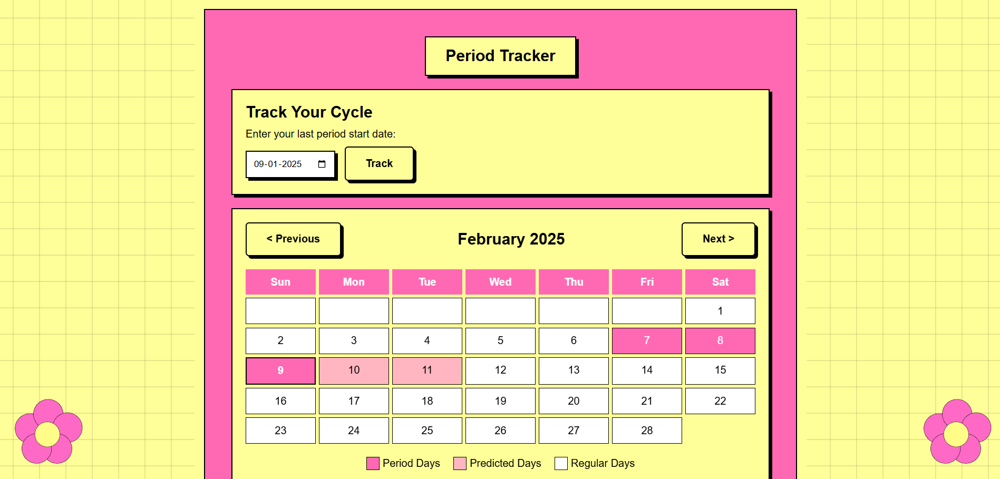

# NANDANA VS TEAM 🎯

## Basic Details
### Team Name: NANDANA V S

### Hosted Project Link
[mention your project hosted project link here]

### Project Description
# Menara
(A fusion of Menstruation and Ayara (Thai for cure).)

Menara is a web-based application designed to help users track their menstrual cycle, access a chatbot for menstrual health queries, and generate homemade remedies for menstrual discomfort.
Features

Chatbot: A friendly AI chatbot to answer menstrual health-related questions.

Period Tracker: Users can input their last period date to estimate their next cycle.

Homemade Remedies Generator: Provides natural remedies based on symptoms.

Music: Listen to random music.

Interactive UI: Engaging design with animations and intuitive navigation.

### The Problem statement
Women alone at home who needs access t homemade remedies

### The Solution
A fun chatbot for them to ask anything related to menstruation.

## Technical Details
### Technologies/Components Used
For Software:
Frontend: HTML, CSS, JavaScript

Backend: Flask (Python)

APIs: OpenAI for chatbot integration

### Implementation
For Software:
# Installation
[commands]

# Run
[commands]

### Project Documentation
For Software:

*Explain the final build*

### Project Demo
# Video
[https://youtu.be/GGuFkiQv35s]
*The video shows a go through of the website

## Team Contributions
done and documented by NANDANA VS

---
Made with ❤️ at TinkerHub
